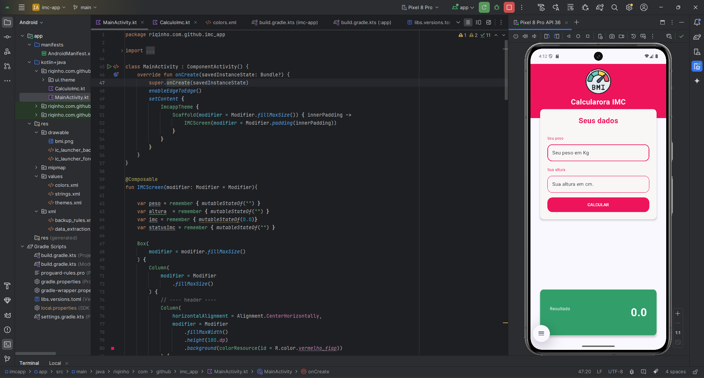
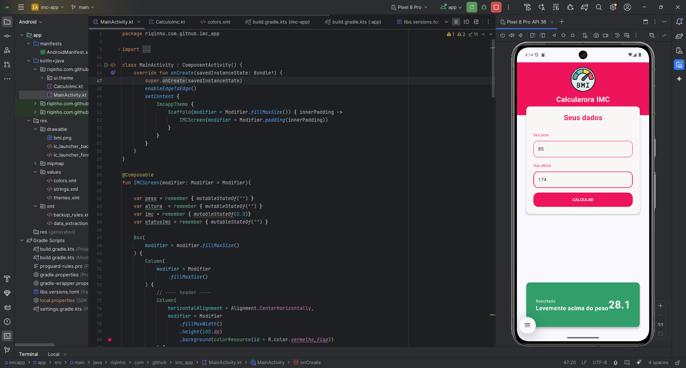

# 🧮 Calculadora IMC

Aplicativo desenvolvido em **Kotlin com Jetpack Compose** para calcular o **Índice de Massa Corporal (IMC)**, exibindo o resultado com mensagens e cores personalizadas conforme a classificação.

---

## 📱 Screenshots

| Tela Inicial | Resultado Calculado |
|:-------------:|:-------------------:|
|  |  |

---

## 👩‍💻 Autores

- **Giovanna Vasques Alexandre** — RM 99884  
- **Rick Alves Domingues** — RM 552438  
- **Wemilli Nataly Lima de Oliveira** — RM 552301  

---

## 🎯 Objetivo

O objetivo do projeto é criar um aplicativo simples e intuitivo que permita ao usuário inserir **peso** e **altura**, calcular o **IMC** e exibir o resultado com base nas faixas definidas pela Organização Mundial da Saúde (OMS).

---

## 🗂 Estrutura do Projeto

```bash
app/
└── src/
    ├── androidTest/
    │   └── java/
    │       └── riqinho/com/github/imc_app/
    ├── main/
    │   ├── java/
    │   │   └── riqinho/com/github/imc_app/
    │   │       ├── ui/theme/          # Definições de tema (cores, tipografia, estilos)
    │   │       ├── CalculoImc.kt      # Tela e lógica principal do cálculo de IMC
    │   │       └── MainActivity.kt    # Ponto de entrada do aplicativo
    │   └── res/
    │       ├── drawable/              # Recursos gráficos e vetoriais
    │       ├── mipmap*/               # Ícones do app em diferentes densidades
    │       ├── values/                # Cores, strings e estilos XML
    │       └── xml/                   # Configurações adicionais
    └── test/                          # (opcional) testes unitários
```

---

## 🧰 Tecnologias utilizadas

- Kotlin
- Jetpack Compose
- Material 3
- Android Studio

---

## ⚙️ Funcionamento resumido
1 - O usuário insere o peso (kg) e a altura (m).
2 - Ao clicar em “Calcular”, o app processa o valor do IMC através da fórmula: imc = peso / altura^2
3 -O resultado é exibido com:
- O valor numérico do IMC;
- Uma mensagem de classificação (ex.: “Peso ideal”, “Sobrepeso”, “Obesidade”);
-Uma cor correspondente à categoria (verde, amarelo, vermelho etc.).

---

## 💡 Aprendizados
Durante o desenvolvimento, aprendemos a:
- Criar interfaces declarativas com Jetpack Compose;
- Usar estados reativos para atualizar valores em tempo real;
- Aplicar boas práticas de organização de pacotes e componentização;
- Utilizar temas com Material 3 e personalização de cores.

---

## 🧾 Licença
Projeto acadêmico — uso livre para fins educacionais.

---
